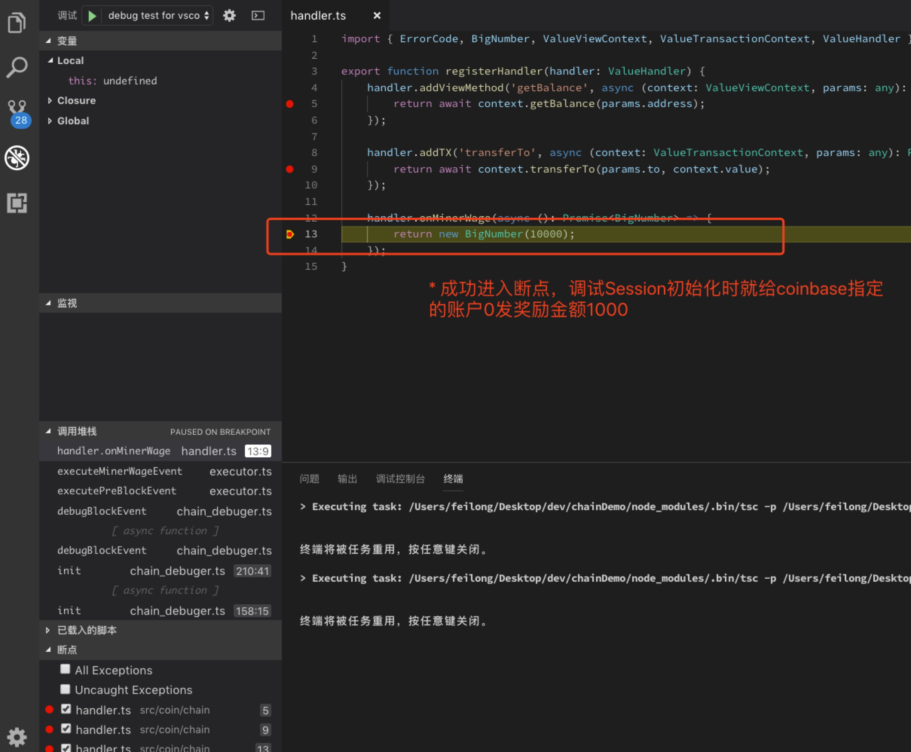
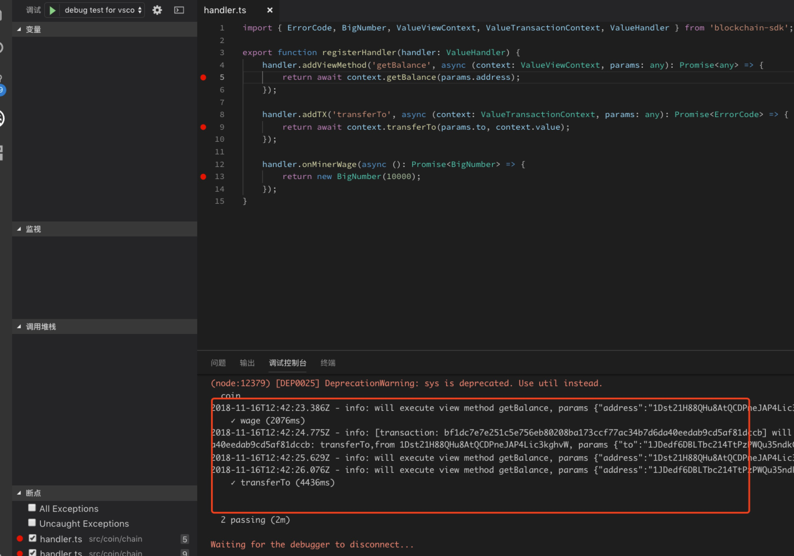
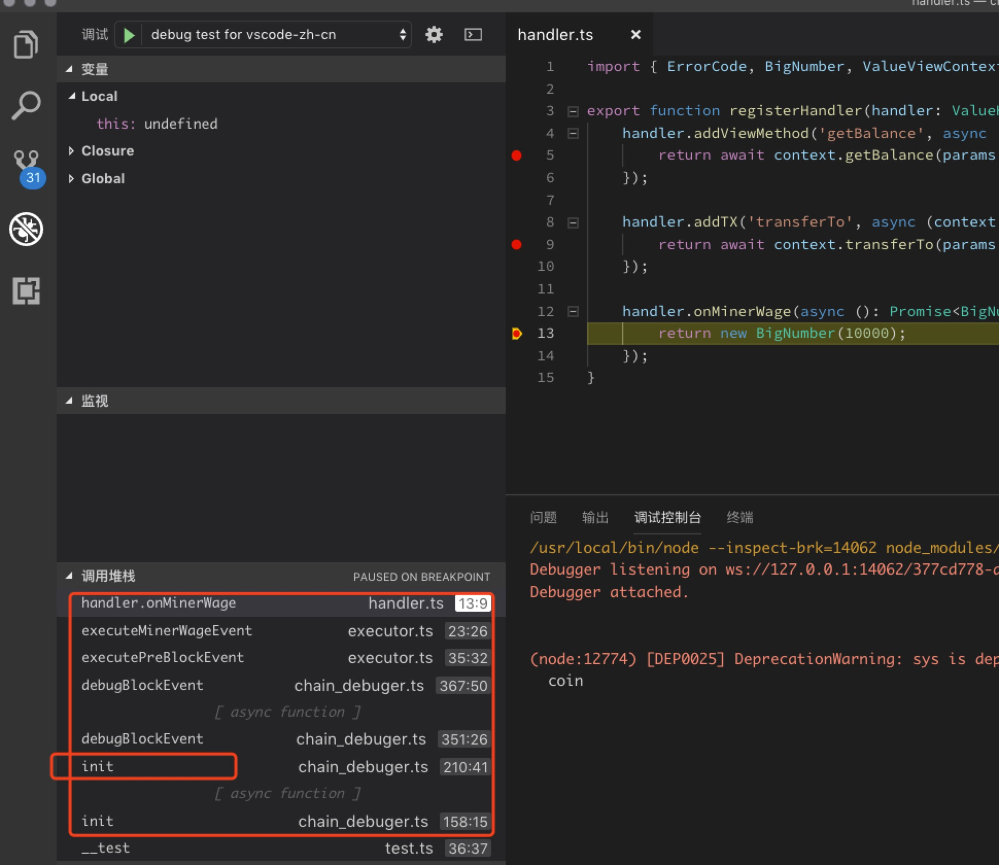
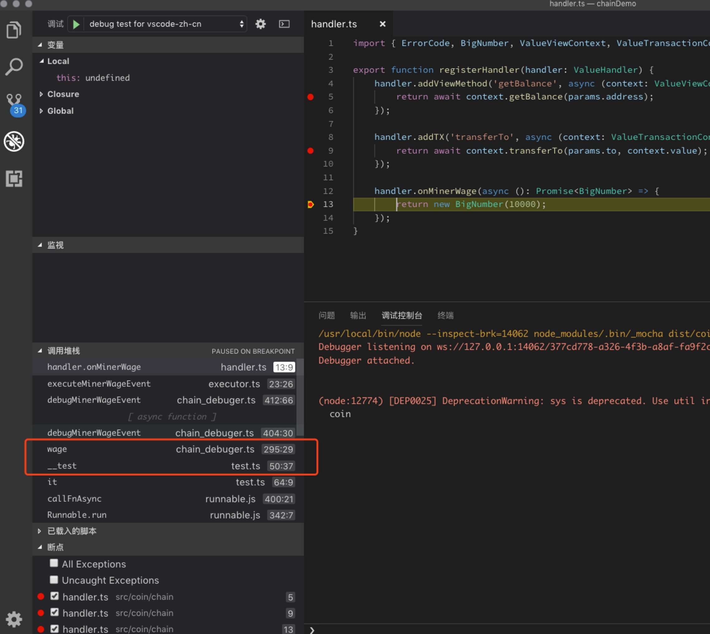
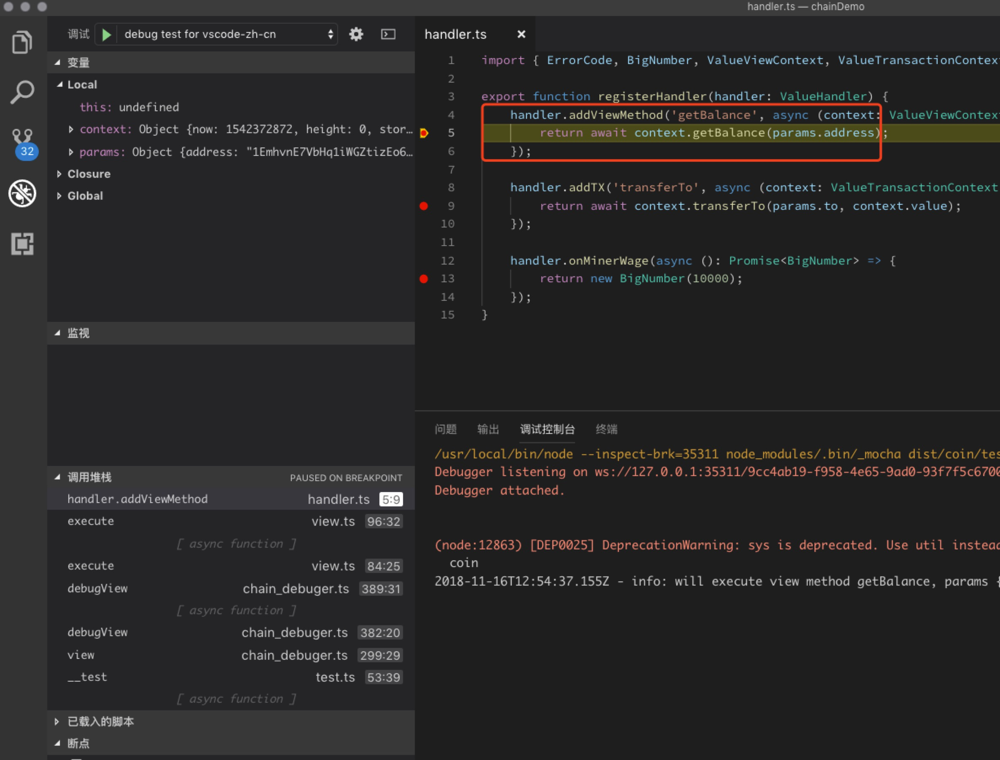
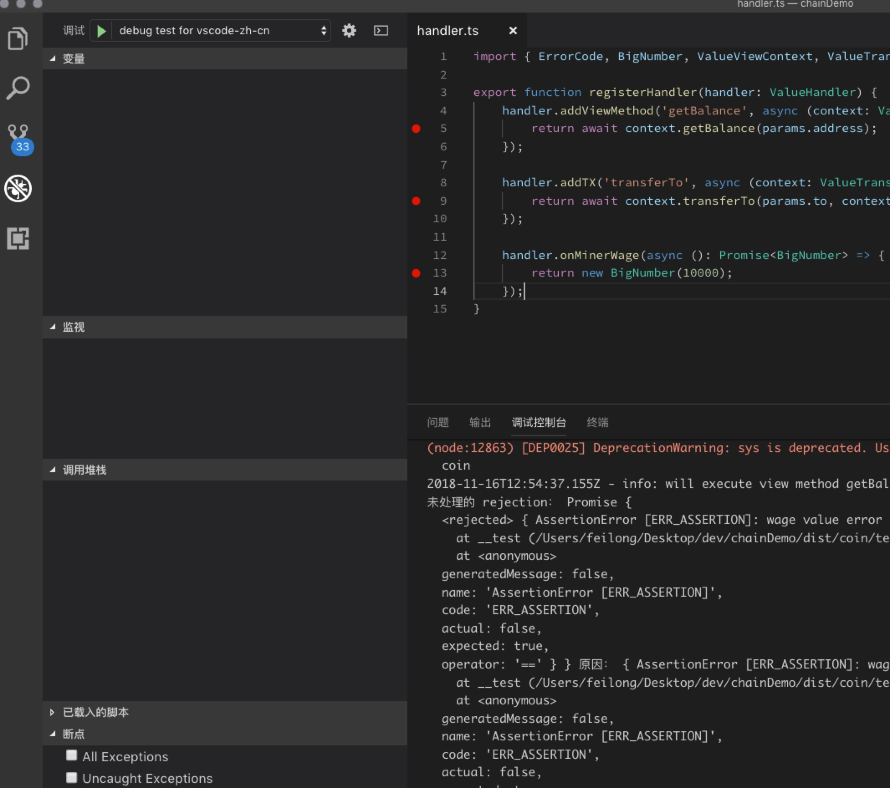

ChainSDK提供了完善的合约开发测试和调试能力。在上一节我们已经初步接触了`src/coin/test`的测试用例代码。

本节，你将掌握：
* 在Visual Studio Code里执行测试用例代码。
* 在Visual Studio Code里断点并调试合约代码。

## 安装依赖

从https://code.visualstudio.com/ 上下载并安装最新版本的Visual Studio Code。

## 打开项目

1. 打开Visual Studio Code
2. 使用Visual Studio Code打开chainDemo目录
3. 可以看到git仓库里已经自带了 `.vscode` 目录，该目录是Visual Studio Code的项目配置目录。
    * 其中`.vscode/launch.json`里预先配置了四个启动项目：
        * `debug test for vscode-zh-cn`
        * `debug test for vscode-en`
        * `debug test for windows-vscode-zh-cn`
        * `debug test for windows-vscode-en`
    * 上述四个启动项，分别考虑到了下面两个因素，请根据自己的环境选择：
        * vscode中文版/英文版
        * windows环境和非windows环境

## 执行测试用例

首先，执行命令编译下代码：`gulp build`。

打开`src/coin/chain/handler.js`，并在下图所示的三个地方分别添加断点。


如下图，点击VSCode左侧的调试面板，然后选择顶部的`调试`项目，例如在Mac系统上中文版VSCode选择`debug test for vscode-zh-cn`


点击顶部的调试按钮，进入调试，如图所示，进入了调试界面。


一路按F5（Mac平台请按fn+F5)，一直到执行结束。如图所示，VSCode的调试控制台里输出了调试的日志，两个测试用例都通过了测试：


## 诊断问题

我们看下`src/test/test.ts`里的第60行代码：
```TypeScript
assert((gbr.value! as BigNumber).eq(10000*2), 'wage value error', gbr);
```

我们把金额从`10000*2`改为`10000`:
```TypeScript
assert((gbr.value! as BigNumber).eq(10000), 'wage value error', gbr);
```

然后，我们先在命令行下执行编译并测试命令：
```
gulp build
node run.js -chain coin -session test
```

可以看到测试失败了：
```
(node:12634) [DEP0025] DeprecationWarning: sys is deprecated. Use util instead.
  coin
2018-11-16T12:48:40.594Z - info: will execute view method getBalance, params {"address":"15gVpVv2WVi4TUPVEQWNfTJeB5zaQo6PC9"} view.js:58
未处理的 rejection： Promise {
  <rejected> { AssertionError [ERR_ASSERTION]: wage value error
    at __test (/Users/feilong/Desktop/dev/chainDemo/dist/coin/test/test.js:51:13)
    at <anonymous>
  generatedMessage: false,
  name: 'AssertionError [ERR_ASSERTION]',
  code: 'ERR_ASSERTION',
  actual: false,
  expected: true,
  operator: '==' } } 原因： { AssertionError [ERR_ASSERTION]: wage value error
    at __test (/Users/feilong/Desktop/dev/chainDemo/dist/coin/test/test.js:51:13)
    at <anonymous>
  generatedMessage: false,
  name: 'AssertionError [ERR_ASSERTION]',
  code: 'ERR_ASSERTION',
  actual: false,
  expected: true,
  operator: '==' }
```

现在，我们在VSCode里调试，可以看到，程序在获取矿工奖励到地方断点了，看左下角的栈信息，可以看到第一次调用矿工奖励是在init的内部触发的。


接着，按F5（Mac下按Fn+F5)继续调试，可以看到还是停留在原地，但是观察左下角的栈信息，则是从测试代码里调用的`await session!.wage()`触发的。


再次，按F5（Mac下按Fn+F5)继续调试，可以看到进入了`getBalance()`函数


最后，按F5（Mac下按Fn+F5)继续调试，可以看到，程序在测试里面的断言地方失败了，这正是由于给账户0分配了两次奖励，因此账户0的余额应该是`10000*2`导致的。


## 结束

很好，到这里，你已经具备了调试诊断的技能，让开发DApp也能方便的调试并诊断问题！